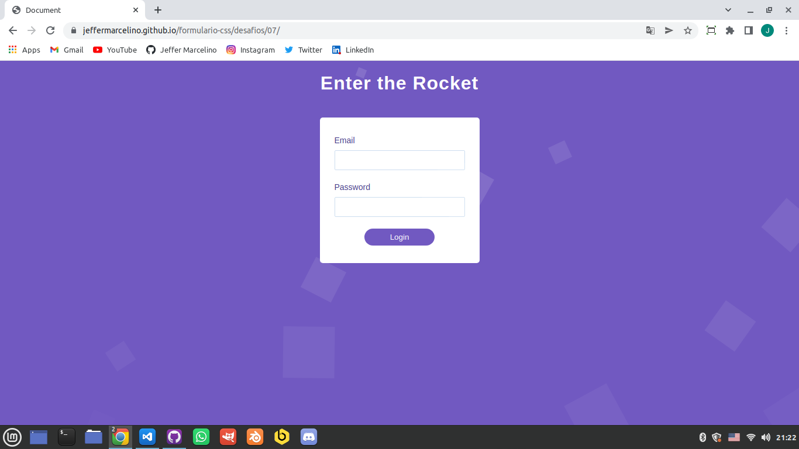

<h1>Formulario-css</h1>

 

## Preview:

  

## 🚀 Technologies

This project was developed with the following technologies:

- HTML
- CSS
- JavaScript

## 💻 Project

Formulario-css is a form with some simple animations but it gives a good user experience. You can use on your pages to make a registration page where the user will put his email and password.

### Parts
The project has 7 parts, each of them the animations are increasing and getting better.
- [Base](https://github.com/JefferMarcelino/formulario-css/tree/main/base)
- [Part 1](https://github.com/JefferMarcelino/formulario-css/tree/main/desafios/01)
- [Part 2](https://github.com/JefferMarcelino/formulario-css/tree/main/desafios/02)
- [Part 3](https://github.com/JefferMarcelino/formulario-css/tree/main/desafios/03)
- [Part 4](https://github.com/JefferMarcelino/formulario-css/tree/main/desafios/04)
- [Part 5](https://github.com/JefferMarcelino/formulario-css/tree/main/desafios/05)
- [Part 6](https://github.com/JefferMarcelino/formulario-css/tree/main/desafios/06)
- [Part 7](https://github.com/JefferMarcelino/formulario-css/tree/main/desafios/07)

## 📝 License

This project is under the MIT license. See the file [LICENSE](./LICENSE) for more details.

---

Made by ♥ :wave: [Jeffer Marcelino!](https://github.com/JefferMarcelino/)
